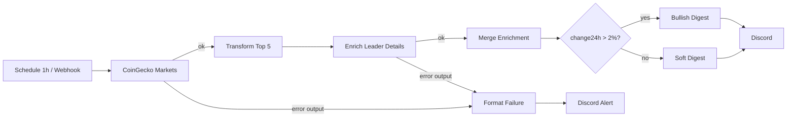
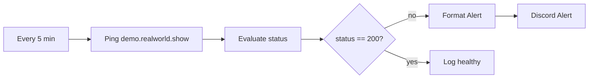

# Workflow diagrams (for interview / Loom)

## Task 2 — Morning Brief

```mermaid
flowchart LR
  A[Schedule 1h / Webhook] --> B[CoinGecko Markets]
  B -->|ok| C[Transform Top 5]
  B -->|error output| E[Format Failure]
  C --> D[Enrich Leader Details]
  D -->|ok| F[Merge Enrichment]
  D -->|error output| E
  F --> G{change24h > 2%?}
  G -->|yes| H[Bullish Digest]
  G -->|no| I[Soft Digest]
  H --> J[Discord]
  I --> J
  E --> K[Discord Alert]
```

## Bonus — Uptime Monitor

```mermaid
flowchart LR
  A[Every 5 min] --> B[Ping demo.realworld.show]
  B --> C[Evaluate status]
  C --> D{status == 200?}
  D -->|no| E[Format Alert]
  D -->|yes| F[Log healthy]
  E --> G[Discord Alert]
```
